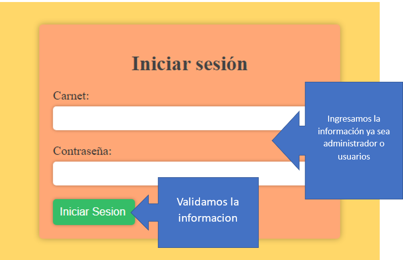
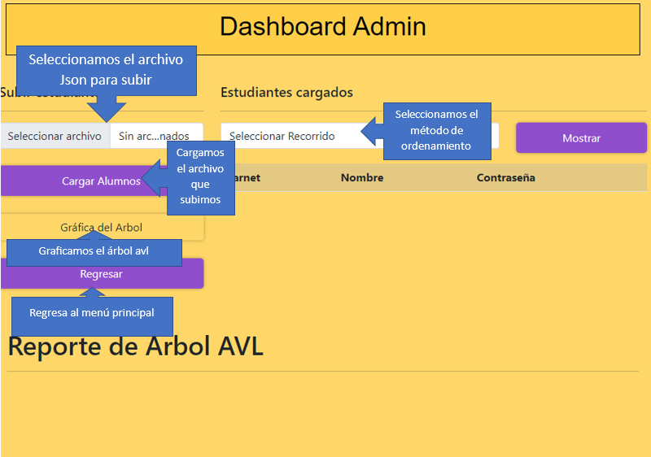
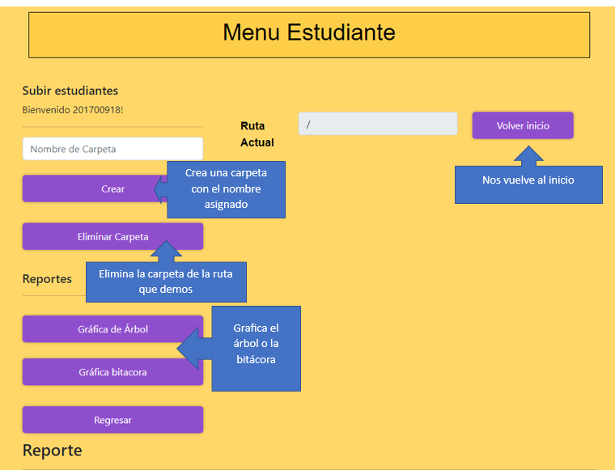

###### Universidad de San Carlos de Guatemala
###### Facultad de Ingeniería
###### Estructuras de Datos
###### Primer Semestre de 2023

|Nombre  | Carnet | 
|------------- | -------------|
|Jorge Sebastian Zamora Polanco  | 202002591|

# Manual Tecnico

## Proyecto EDD "Go Drive"  Fase:2

### Resumen
El sistema debe tener un funcionamiento similar a Google Drive con la característica que nos da el enunciado,  además de otras características propias de la aplicación. 

Estructuras a utilizar:
- Árbol AVL: Usuarios que estén en el sistema ya aceptados.
- Matriz Dispersa: Se utilizará para manejar permisos en las carpetas del
directorio actual.
- Árbol Multicamino o N-ario: se usará para el manejo de los sistemas de
archivos.
- Lista Circular: Manejo de logs, creación o eliminación de carpetas o archivos
ligados a cada usuario

## Descripcion de los paquetes
a continuacion se describe las funciones y las estructuras
### scripts: admin

|  Función | Descripción  |
| :------------: | :------------: |
|  cargarEstudiante   |  Lee el archivo Json que se le envia y lo guarda en el arbol Avl |
|   showStudentsForm | Nos muestra a los estudiantes en el orden que querramos |
|   showAvlGraph | Muestra el arbol Avl graficado  |
| administrador  | valida si somos administrador o un usuario |
| crearCarpeta | funcion que crea una carpeta y la muestra en la pagina |
| entrarCarpeta | hace que podamos entrar a una carpera dandole click |
| showTreeGraph |muestra el arbol N ario del estudiante |
|  ShowBitacora |   Muestra la lista circular del estudiante |
|  deleteCarpeta |  Elimina la carpeta que querramos |

### Estrucuras 

| Estructura  |  Descripción |
| :------------: | :------------: |
| avl-tree | Crea el arbol avl de los estudiantes y tambien hace que cada nodo tenga un arbol N ario y una lista circular |
|  nario-tree |   maneja los directorio que crea el estudiante en una estuctura de un arbol N-ario |
|  circular-list |  En esta estructura se guarda la informacion de los movimientos de los usuarios |

# Manual Usuario

#### Inicio de sesion

#### administrador

#### estudiante

